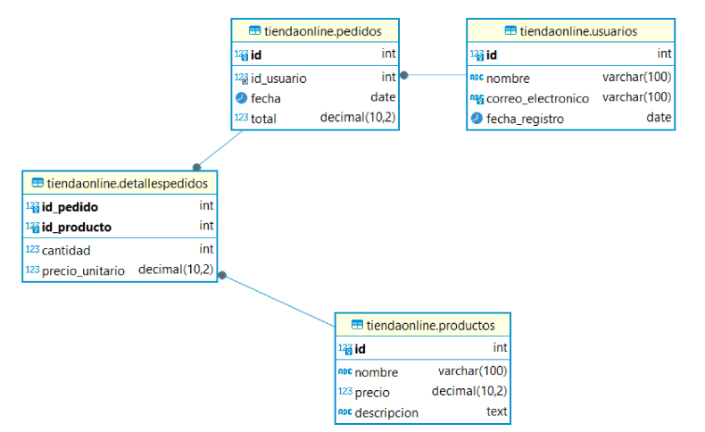

# filtroDB
Bienvenidos al proyecto de creación de la base de datos para nuestra tienda en línea, Tech Haven. Como propietario de esta tienda, necesito una solución robusta para gestionar toda la información relacionada con nuestros productos, clientes y pedidos. La base de datos será fundamental para organizar y mantener nuestros registros de manera eficiente,permitiéndonos brindar un mejor servicio a nuestros clientes y tomar decisiones informadas para el crecimiento del negocio.


## Consultas
1. Obtener la lista de todos los productos con sus precio
    ```sql
        SELECT nombre, precio
        FROM  productos;
    ```
    ```
        +-------------------------+---------+
        | nombre                  | precio  |
        +-------------------------+---------+
        | Iphone 13               |  799.99 |
        | Samsung Galaxy S21      |  699.99 |
        | Sony WH-1000MXM4        |  349.99 |
        | MacBook Pro             | 1299.99 |
        | Dell XPS 13             |  999.99 |
        | GoPro HERO9             |  399.99 |
        | Amazon Echo Dot         |   49.99 |
        | Kindle Paperwhite       |  129.99 |
        | Apple Watch Series 7    |  399.99 |
        | Bose QuietComfort 35 II |  299.99 |
        | Nintendo Switch         |  299.99 |
        | Fitbit Charge 5         |  179.95 |
        +-------------------------+---------+
    ```
1. Encontrar todos los pedidos realizados por un usuario específico, por ejemplo, Juan Perez
    ```sql
        SELECT id_usuario, fecha, total
        FROM pedidos
        WHERE id_usuario = 1;
    ```
    ```
        +------------+------------+---------+
        | id_usuario | fecha      | total   |
        +------------+------------+---------+
        |          1 | 2024-02-25 | 1049.98 |
        +------------+------------+---------+
    ```

1. Listar los detalles de todos los pedidos, incluyendo el nombre del producto, cantidad y precio unitario.
    ```sql
        SELECT DP.id_pedido AS PedidoID, P.nombre AS Producto, DP.cantidad, DP.precio_unitario
        FROM detallepedidos AS DP
        INNER JOIN productos AS P ON DP.id_producto = P.id;
    ```
    ```
        +----------+-------------------------+----------+-----------------+
        | PedidoID | Producto                | cantidad | precio_unitario |
        +----------+-------------------------+----------+-----------------+
        |        1 | Iphone 13               |        1 |          799.99 |
        |        1 | Amazon Echo Dot         |        5 |           49.99 |
        |        2 | MacBook Pro             |        1 |         1299.99 |
        |        2 | Kindle Paperwhite       |        1 |          129.99 |
        |        3 | Samsung Galaxy S21      |        1 |          699.99 |
        |        3 | Apple Watch Series 7    |        1 |          399.99 |
        |        4 | Dell XPS 13             |        1 |          999.99 |
        |        4 | Bose QuietComfort 35 II |        1 |          299.99 |
        |        5 | Sony WH-1000MXM4        |        1 |          349.99 |
        |        5 | Nintendo Switch         |        1 |          299.99 |
        |        6 | GoPro HERO9             |        1 |          399.99 |
        +----------+-------------------------+----------+-----------------+
    ```
1. Calcular el total gastado por cada usuario en todos sus pedidos
    ```sql
        SELECT US.nombre as Usuario, P.total AS 'Total gastado'
        FROM usuarios AS US
        INNER JOIN pedidos AS P ON US.id = P.id_usuario;
    ```
    ```
        +----------------+---------------+
        | Usuario        | Total gastado |
        +----------------+---------------+
        | Juan Perez     |       1049.98 |
        | Maria Lopez    |       1349.98 |
        | Carlos Mendoza |       1249.99 |
        | Ana Gonzales   |        449.98 |
        | Luis Torres    |        699.99 |
        | Laura Rivera   |        399.99 |
        +----------------+---------------+
    ```

1. Encontrar los productos más caros (precio mayor a $500)
    ```sql
        SELECT nombre, precio
        FROM productos
        WHERE precio > 500;
    ```
    ```
        +--------------------+---------+
        | nombre             | precio  |
        +--------------------+---------+
        | Iphone 13          |  799.99 |
        | Samsung Galaxy S21 |  699.99 |
        | MacBook Pro        | 1299.99 |
        | Dell XPS 13        |  999.99 |
        +--------------------+---------+
    ```

1. Listar los pedidos realizados en una fecha específica, por ejemplo 2024-03-10
    ```sql
        SELECT id, id_usuario, fecha, total
        FROM pedidos
        WHERE fecha = '2024-03-10';
    ```
    ```
        +----+------------+------------+---------+
        | id | id_usuario | fecha      | total   |
        +----+------------+------------+---------+
        |  2 |          2 | 2024-03-10 | 1349.98 |
        +----+------------+------------+---------+
    ```
1. Obtener el número total de pedidos realizados por cada usuario
    ```sql
        SELECT US.nombre, COUNT(P.id) AS 'NumeroDePedidos'
        FROM usuarios AS US
        INNER JOIN pedidos AS P ON US.id = P.id_usuario
        GROUP BY US.id;
    ```
    ```
        +----------------+-------------+
        | nombre         | COUNT(P.id) |
        +----------------+-------------+
        | Juan Perez     |           1 |
        | Maria Lopez    |           1 |
        | Carlos Mendoza |           1 |
        | Ana Gonzales   |           1 |
        | Luis Torres    |           1 |
        | Laura Rivera   |           1 |
        +----------------+-------------+
    ```
1. Encontrar el nombre del producto más vendido (mayor cantidad total vendida)
    ```sql
        SELECT P.nombre, SUM(DP.cantidad) AS 'CantidadTotal'
        FROM detallepedidos AS DP
        INNER JOIN productos AS P ON DP.id_producto = P.id
        GROUP BY DP.id_producto
        ORDER BY CantidadTotal desc
        LIMIT 1;
    ```
    ```
        +-----------------+---------------+
        | nombre          | CantidadTotal |
        +-----------------+---------------+
        | Amazon Echo Dot |             5 |
        +-----------------+---------------+
    ```

1. Listar todos los usuarios que han realizado al menos un pedido
    ```sql
        SELECT nombre, correo_electronico
        FROM usuarios AS US 
        LEFT JOIN pedidos AS P ON US.id = P.id_usuario;
    ```
    ```
        +----------------+-----------------------------+
        | nombre         | correo_electronico          |
        +----------------+-----------------------------+
        | Juan Perez     | juan.perez@exameple.com     |
        | Maria Lopez    | maria.lopez@example2.com    |
        | Carlos Mendoza | carlos.mendoza@example3.com |
        | Ana Gonzales   | ana.gonzales@example4.com   |
        | Luis Torres    | luis.torres@example5.com    |
        | Laura Rivera   | laura.rivera@example.com    |
        +----------------+-----------------------------+
    ```

1. Obtener los detalles de un pedido específico, incluyendo los productos y cantidades, por ejemplo, pedido con id 1
    ```sql
        SELECT P.id AS PedidoID, US.nombre AS Usuario, PR.nombre AS Producto, DP.cantidad, DP.precio_unitario
        FROM usuarios AS US
        INNER JOIN pedidos AS P ON US.id = id_usuario
        INNER JOIN detallepedidos AS DP ON P.id = DP.id_pedido
        INNER JOIN productos AS PR ON DP.id_producto = PR.id
        WHERE P.id = 1;
    ```
    ```
        +----------+------------+-----------------+----------+-----------------+
        | PedidoID | Usuario    | Producto        | cantidad | precio_unitario |
        +----------+------------+-----------------+----------+-----------------+
        |        1 | Juan Perez | Iphone 13       |        1 |          799.99 |
        |        1 | Juan Perez | Amazon Echo Dot |        5 |           49.99 |
        +----------+------------+-----------------+----------+-----------------+
    ```
## Subconsultas
1. Encontrar el nombre del usuario que ha gastado más en total
    ```sql
        SELECT nombre
        FROM usuarios
        WHERE id = (
            SELECT id_usuario
            FROM pedidos
            ORDER BY total desc
            limit 1
        );
    ```
    ```
        +-------------+
        | nombre      |
        +-------------+
        | Maria Lopez |
        +-------------+
    ```
1. Listar los productos que han sido pedidos al menos una vez
    ```sql
        SELECT nombre
        FROM productos
        WHERE id IN (
            SELECT id_producto
            FROM detallepedidos
        );
    ```
    ```
        +-------------------------+
        | nombre                  |
        +-------------------------+
        | Iphone 13               |
        | Samsung Galaxy S21      |
        | Sony WH-1000MXM4        |
        | MacBook Pro             |
        | Dell XPS 13             |
        | GoPro HERO9             |
        | Amazon Echo Dot         |
        | Kindle Paperwhite       |
        | Apple Watch Series 7    |
        | Bose QuietComfort 35 II |
        | Nintendo Switch         |
        +-------------------------+
    ```

1. Obtener los detalles del pedido con el total más alto
    ```sql
        SELECT DISTINCT PP.id, PP.id_usuario, PP.fecha, PP.total
        FROM detallepedidos AS DP
        INNER JOIN pedidos AS PP ON DP.id_pedido = PP.id
        WHERE id_pedido = (
            SELECT P.id
            FROM pedidos AS P
            ORDER BY total desc
            LIMIT 1
        );
    ```
    ```
        +----+------------+------------+---------+
        | id | id_usuario | fecha      | total   |
        +----+------------+------------+---------+
        |  2 |          2 | 2024-03-10 | 1349.98 |
        +----+------------+------------+---------+
    ```

1. Listar los usuarios que han realizado más de un pedido.
    ```sql
        SELECT US.nombre
        FROM usuarios AS US
        WHERE id IN (
            SELECT id_usuario
            FROM pedidos
            GROUP BY id_usuario
            HAVING COUNT(id_usuario) > 2
        );
    ```
    ```
        Empty set (0,00 sec)
    ```

1. Encontrar el producto más caro que ha sido pedido al menos una vez
    ```sql
        SELECT nombre, precio
        FROM productos
        WHERE id = (
            SELECT id_producto
            FROM detallepedidos
            ORDER BY precio_unitario desc
            LIMIT 1
        );
    ```
    ```
        +-------------+---------+
        | nombre      | precio  |
        +-------------+---------+
        | MacBook Pro | 1299.99 |
        +-------------+---------+
    ```
## Procedimientos Almacenados

1. Crea un procedimiento almacenado llamado AgregarProducto que reciba como
parámetros el nombre, descripción y precio de un nuevo producto y lo inserte en la tabla Productos.
    ```sql
        DELIMITER $$
        CREATE PROCEDURE AgregarProducto (
            IN nombre VARCHAR(100),
            IN precioNuevo DECIMAL(10, 2),
            IN descripcion TEXT
        )
        BEGIN
            INSERT INTO productos (nombre, precio, descripcion)
            VALUES (nombre, precioNuevo, descripcion);
        END $$
        DELIMITER ;
    ```
    ```
    CALL AgregarProducto('ASUS',150.00, 'ASUS TUF GAMING 504GE LO MEJOR DE MI EPOCA');
    ```
1. Crea un procedimiento almacenado llamado ObtenerDetallesPedido que reciba
como parámetro el ID del pedido y devuelva los detalles del pedido, incluyendo el nombre del producto, cantidad y precio unitario.

    ```sql
        DELIMITER $$
        CREATE PROCEDURE ObtenerDetallesPedido (
            IN idPedido INT
        )
        BEGIN
            SELECT PR.nombre AS Producto, DP.cantidad, DP.precio_unitario
            FROM detallepedidos AS DP
            INNER JOIN productos AS PR ON DP.id_producto = PR.id
            WHERE DP.id_pedido = idPedido;
        END $$
        DELIMITER ;
    ```
    ```
    CALL ObtenerDetallesPedido(1);
    ```

1. Crea un procedimiento almacenado llamado ActualizarPrecioProducto que reciba como parámetros el ID del producto y el nuevo precio, y actualice el precio del producto en la tabla Productos .
    ```sql
        DELIMITER $$
        CREATE PROCEDURE ActualizarPrecioProducto (
            IN id_producto INT,
            IN precio_nuevo DECIMAL(10,2)
        )
        BEGIN
            UPDATE productos
            SET precio = precio_nuevo
            WHERE id = id_producto;
        END $$
        DELIMITER ;
    ```
    ```
    CALL ActualizarPrecioProducto(13, 222.00);
    ```

1. Crea un procedimiento almacenado llamado EliminarProducto que reciba como
parámetro el ID del producto y lo elimine de la tabla Productos .
    ```sql
        DELIMITER $$
        CREATE PROCEDURE EliminarProducto (
            IN id_producto INT
        )
        BEGIN
            DELETE FROM productos WHERE id = id_producto;
        END $$
        DELIMITER ;
    ```
    ```
    CALL EliminarProducto(13);
    ```

1. Crea un procedimiento almacenado llamado TotalGastadoPorUsuario que reciba
como parámetro el ID del usuario y devuelva el total gastado por ese usuario en todos sus pedidos.
    ```sql
        DELIMITER $$
        CREATE PROCEDURE TotalGastadoPorUsuario (
            IN idd INT
        )
        BEGIN
            SELECT SUM(total) AS 'Total gastado'
            FROM pedidos
            WHERE id_usuario = idd
            GROUP BY id_usuario;
        END $$
        DELIMITER ;
    ```
    ```
    CALL TotalGastadoPorUsuario(1);
    ```